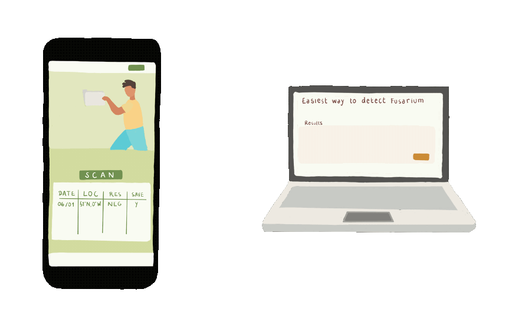
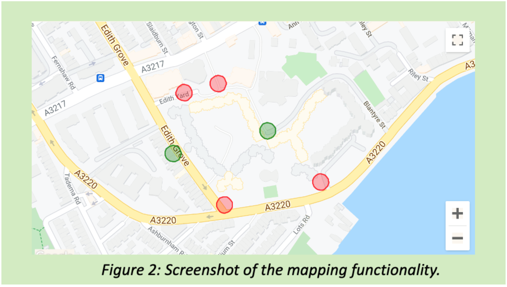

# Crescentech Fusarium Tracker

Crescentech is an Ionic React mobile web app that helps farmers trace and record the spread of fusarium in their crops. The app focuses on quick field data capture with NFC tags, location stamping, and simple syncing so growers can monitor infection results and share them for analysis.

## Features
- **NFC-driven sample capture:** The Collect tab walks users through enabling NFC and scanning tagged samples, then shows the decoded tag payload for logging fusarium test data
- **Field result review:** The Upload Data tab shows recent sample titles, dates, and fusarium results alongside sync status icons, with a placeholder Upload button for pushing results to the backend analysis site.
- **Location capture utility:** A reusable geolocation button retrieves GPS coordinates to pair field readings with their precise location.
- **Authentication shell:** Basic login and profile screens gate the data capture experience and allow the user to log out or navigate to registration flows.



## Project Structure
- `src/App.tsx`: App shell with routing across Collect, Upload Data, and Profile tabs.
- `src/pages/Collect.tsx`: NFC capture page.
- `src/components/NFCReader.tsx`: NFC state machine that initializes listeners, waits for tags, and decodes payloads.
- `src/pages/Sync.tsx` and `src/pages/Table.tsx`: Upload flow mock plus historical fusarium results table.
- `src/components/Location.tsx`: Geolocation helper button.
- `src/pages/Login.tsx` and `src/pages/Profile.tsx`: Authentication UI scaffolding.

## Getting Started
1. **Install dependencies**
   ```bash
   npm install
   ```
2. **Run the app in the browser**
   ```bash
   npm start
   ```
   The Ionic React dev server opens at `http://localhost:3000`.
3. **Build for production**
   ```bash
   npm run build
   ```
4. **Capacitor mobile builds (optional)**
   - Add a platform (Android/iOS) after configuring Capacitor: `npx cap add android` or `npx cap add ios`.
   - Sync web assets into the native projects: `npx cap sync`.
   - Open the native project in Android Studio/Xcode to run on devices.

## Environment & APIs
- NFC interactions rely on the PhoneGap NFC plugin and must run on devices with NFC hardware and permissions enabled.
- Geolocation uses `@ionic-native/geolocation`, which requires runtime permissions on mobile platforms.
- Authentication requests target the existing backend at `https://evening-eyrie-40887.herokuapp.com/api/auth`. Update `src/context.tsx` if the endpoint changes.

## App Screenshots


